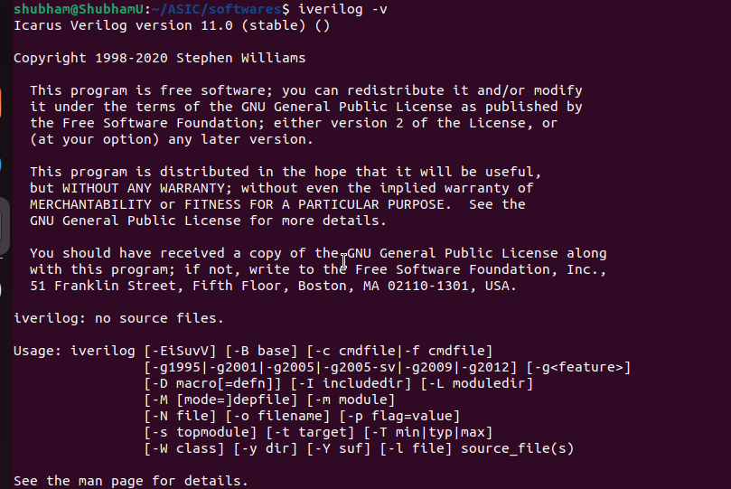
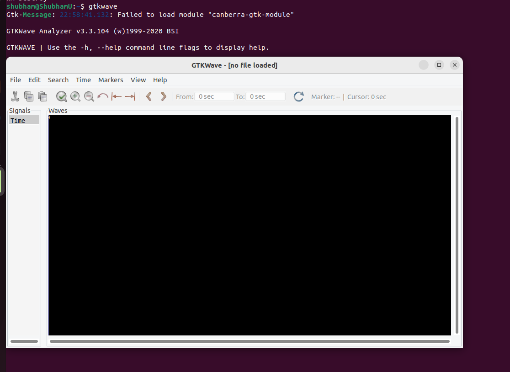
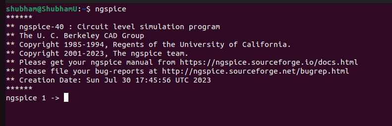

# Physical Design Using ASIC Class


[Day 0](#day-0) Installation of required EDA Tools.

## Day 0


<details>
 <summary> Yosys </summary>
    Commands to install Yosys on Linux.
	
```

$ git clone https://github.com/YosysHQ/yosys.git
$ cd yosys-master 
$ sudo apt install make (If make is not installed please install it) 
$ sudo apt-get install build-essential clang bison flex \
    libreadline-dev gawk tcl-dev libffi-dev git \
    graphviz xdot pkg-config python3 libboost-system-dev \
    libboost-python-dev libboost-filesystem-dev zlib1g-dev
$ make config-gcc
$ make 
$ sudo make install

```
Below is the screenshot showing sucessful Launch:


</details>	


<details>
 <summary> iVerilog </summary>
    Commans to install iVerilog
    
	
```

sudo apt-get install iverilog.

```

Below is the screenshot showing sucessful Launch:

</details>
 <details>
 <summary> gtkwave </summary>


 I installed gtkwave using the following command:
  ```bash
sudo apt-get install gtkwave
 ```

Below is the screenshot showing sucessful Launch:


</details>

 <details>
 <summary> ngspice </summary>


 I downloaded the tarball from https://sourceforge.net/projects/ngspice/files/ to a local directory and unpacked it using the following commands:
 ```bash
tar -zxvf ngspice-37.tar.gz
cd ngspice-37
mkdir release
cd release
../configure  --with-x --with-readline=yes --disable-debug
make
sudo make install
 ```
Below is the screenshot showing sucessful Launch:



</details>

