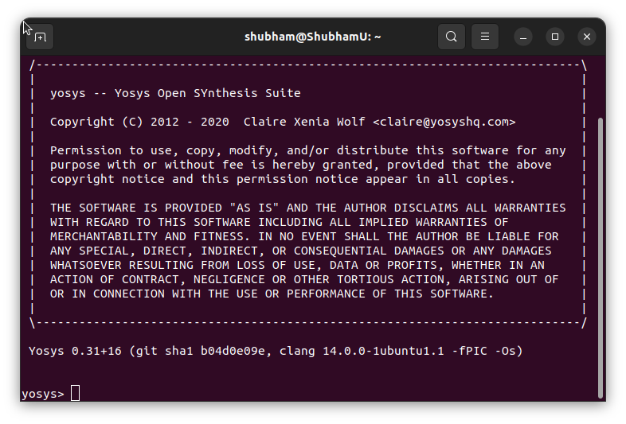

# Physical Design Using ASIC Class


## Day 1


<details>
 <summary> Yosys </summary>
    Commands to install Yosys on Linux.
	
```

$ git clone https://github.com/YosysHQ/yosys.git
$ cd yosys-master 
$ sudo apt install make (If make is not installed please install it) 
$ sudo apt-get install build-essential clang bison flex \
    libreadline-dev gawk tcl-dev libffi-dev git \
    graphviz xdot pkg-config python3 libboost-system-dev \
    libboost-python-dev libboost-filesystem-dev zlib1g-dev
$ make config-gcc
$ make 
$ sudo make install

```
Below is the screenshot showing sucessful Launch:


</details>	


<details>
 <summary> iVerilog </summary>
    Commans to install iVerilog
    
	
```

sudo apt-get install iverilog.

```

Below is the screenshot showing sucessful Launch:

</details>
 <details>
 <summary> gtkwave </summary>


 I installed gtkwave using the following command:
  ```bash
sudo apt-get install gtkwave
 ```

Below is the screenshot showing sucessful Launch:


</details>

 <details>
 <summary> ngspice </summary>


 I downloaded the tarball from https://sourceforge.net/projects/ngspice/files/ to a local directory and unpacked it using the following commands:
 ```bash
tar -zxvf ngspice-37.tar.gz
cd ngspice-37
mkdir release
cd release
../configure  --with-x --with-readline=yes --disable-debug
make
sudo make install
 ```
Below is the screenshot showing sucessful Launch:


</details>

 <details>
 <summary> magic </summary>


 I installed magic using the following commands:
  ```bash
sudo apt-get install m4
sudo apt-get install tcsh
sudo apt-get install csh
sudo apt-get install libx11-dev
sudo apt-get install tcl-dev tk-dev
sudo apt-get install libcairo2-dev
sudo apt-get install mesa-common-dev libglu1-mesa-dev
sudo apt-get install libncurses-dev
 ```
 Below is the screenshot showing sucessful Launch:


 </details>

  <details>
 <summary> OpenSTA </summary>


 I installed and built OpenSTA (including the needed packages) using the following commands:
 ```bash
sudo apt-get install cmake clang gcctcl swig bison flex
git clone https://github.com/The-OpenROAD-Project/OpenSTA.git
cd OpenSTA
mkdir build
cd build
cmake ..
make
```
Below is the screenshot showing sucessful Launch:


</details>

## Day 2
<details>
 <summary> Introduction to iverilog, Design and Test Bench</summary>


#### Simulation

* RTL design is checked for adherence to the spec by simulating the design
* Simulator is the tool used for simulating the design
* iverilog is the tool used for this course


#### Design
* Design is the actual Verilog code or set of Verilog codes which has the intended functionality to meet with the required specifications

#### TestBench
* TestBench is the setup to apply stimulus (test _vectors) to the design to check its functionality


#### How simulator works
* Simulator looks for the changes on the input signals
* Upon change to the input the output is evaluated
* If no change to the input, no change to the output!
* Simulator is looking for change in the values of input!


</details>
<details>
 <summary> Demostration of the Icarus Verilog and GTKWave </summary>


</details>

</details>


<details>
 <summary> Introduction to Yosys </summary>

	
Yosys is an open-source software framework for Verilog RTL (Register Transfer Level) synthesis. It's commonly used in digital design and electronic engineering to convert high-level hardware descriptions written in Verilog into optimized gate-level representations that can be used for ASIC (Application-Specific Integrated Circuit) or FPGA (Field-Programmable Gate Array) implementations. Yosys provides a range of synthesis tools and optimization techniques to generate efficient and compact hardware designs. It's widely used in the hardware design community and is known for its flexibility, extensibility, and ability to handle complex designs.
</details>
 <details>
 <summary> Labs using Yosys and Sky130 PDKs </summary>
	 
To invoke yosys Type ```yosys```.


*Note: We should be in the directory in which we have cloned the github link.


All libraries will be in ```myLib```

**Step-1:** Read the Library 
```
read_liberty -lib ../PATH
```
***Step-2:** Read Design
```
read_verilog FILE NAME


```
***Step-3:** Synthesis 
```
synth -top FILE NAME
```
**Step-4:** Genetare Netlist 

abc is command to convert RTL file to gate. And to what gate is need to specify is Written in the Path. 
```
abc -liberty ../PATH
```
Report Generated


To see logic realised
```
show
```


**Step-5:** To write Netlist 
```
write_verilog FILE NAME
```


</details>


 <details>
 <summary> Timing limbs, hierarchical vs flat synthesis and efficient flop coding styles </summary>
 <details>
 <summary> Introduction to .lib File </summary>


** PVT parameters **


Different versions of the same logic gate


Multiple Modules


</details>
<details>
 <summary> Various Flop Coding Styles </summary>
	

</details>
<details>
 <summary> Why Flops? </summary>


</details>

<details>
 <summary> Asynchronous  </summary>
	


</details>
<details>
 <summary> Synchronous </summary>
	


<details>
 <summary> Synthesis </summary>


</details>
</details>

<details>
 <summary> Synchronous & Asynchronous Reset </summary>
	


</details>

<details>
 <summary> Optimization </summary>


</details>
</details>

## Day 3 : Combinational and sequential optimizations
*Combinational and sequential optimizations are two different approaches used in digital circuit design to improve the performance, efficiency, and reliability of electronic systems. These optimizations target different aspects of the design process and address various challenges that arise when designing complex digital circuits.*

 <details>
 <summary> Combinational Optimizations </summary>
Common techniques for combinational optimization include:

* Gate-Level Optimization: This involves simplifying logic expressions and minimizing the number of logic gates needed to implement a particular function.
* Technology Mapping: Selecting the optimal gate library for implementing a logic function based on the available manufacturing technology.
* Boolean Algebra Simplification: Applying algebraic identities and theorems to simplify Boolean expressions and reduce the complexity of the logic.
* Logic Synthesis: Automatically generating optimized gate-level representations of a design from a high-level description.

**Example AND Gate**


**Example OR Gate**
Nand inverted and Gate


</details>


 <details>
 <summary> Sequential Optimizations </summary>
	 
*Sequential circuits contain memory elements, such as flip-flops and registers, which allow them to store and process data over time. Sequential optimization focuses on improving the clock frequency, reducing power consumption, and ensuring proper timing and synchronization in these circuits.*

Common techniques for sequential optimization include:

* Pipeline Optimization: Breaking down a computation into smaller stages that can be processed concurrently, thus increasing throughput and reducing the critical path delay.
* Clock Gating: Disabling clock signals to specific circuit blocks when they are not needed, reducing power consumption.
* Retiming: Reordering registers within a design to optimize the timing paths and improve the clock frequency.
* State Machine Optimization: Reducing the number of states or transitions in finite state machines to simplify control logic and improve performance.


**Example dff_const1**


Synthesis


**Example dff_const2**


**Example dff_const3**
Waveform


Synthesis


**Example dff_const4**


**Example dff_const5**


**Counter_opt**


</details>
## References
1. https://yosyshq.net/yosys/
2. https://steveicarus.github.io/iverilog/
3. https://gtkwave.sourceforge.net/
4. https://ngspice.sourceforge.io/
5. https://github.com/The-OpenROAD-Project/OpenSTA
6. http://opencircuitdesign.com/magic/


